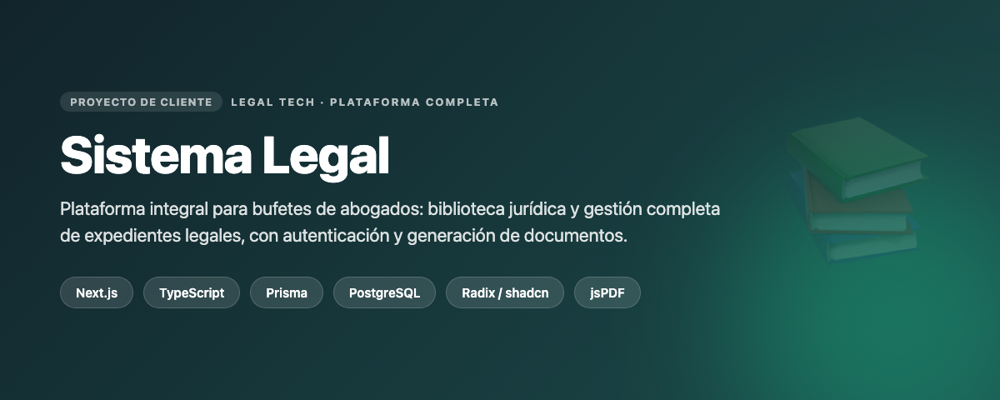
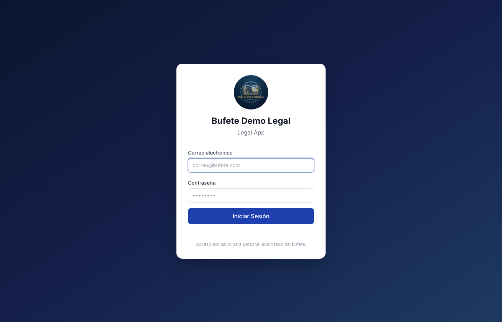
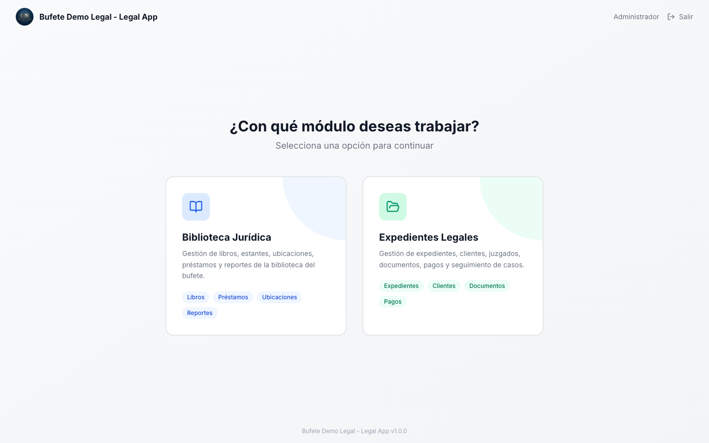
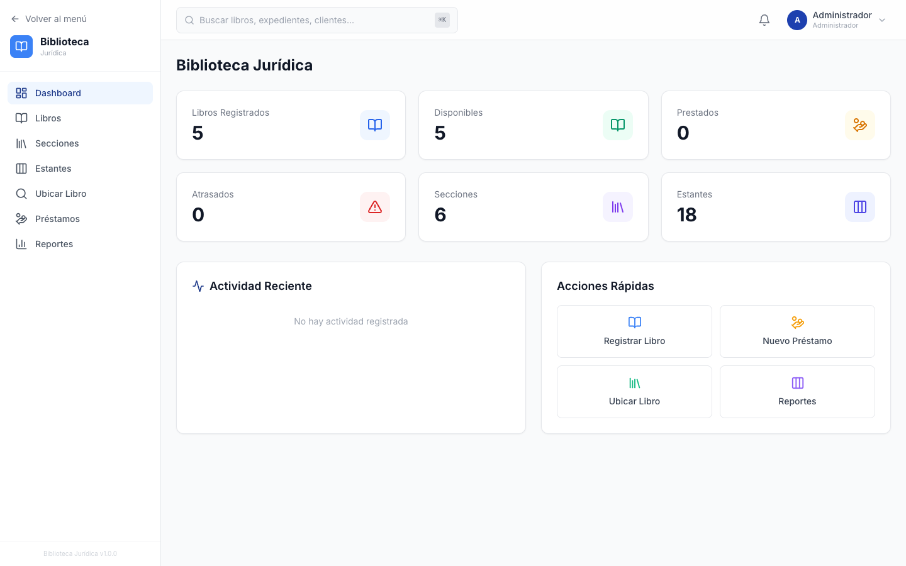
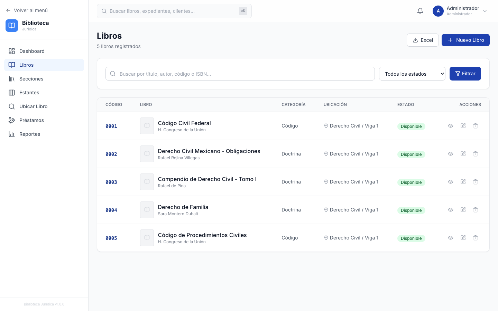

# Sistema Legal

> Plataforma integral de gestión para bufetes de abogados: biblioteca jurídica y gestión completa de expedientes legales, con autenticación, tablas avanzadas y generación de documentos.

---

## 📌 Qué es

Sistema de gestión para bufetes de abogados que combina dos módulos en una sola plataforma: una **biblioteca jurídica** y la **gestión de expedientes legales**. Es el producto base del que derivan despliegues más acotados por cliente.

## ✨ Funcionalidades

- **Biblioteca jurídica**: organización y consulta de recursos legales.
- **Expedientes legales**: clientes, juzgados, documentos, pagos y seguimiento de casos.
- **Selección de módulo** y navegación según el contexto del usuario.
- **Autenticación** y gestión de perfiles.
- **Tablas avanzadas** (filtros, orden, paginación) con TanStack Table.
- **Generación de documentos / PDFs** y vista previa de Word.

## 🛠️ Stack tecnológico

| Capa | Tecnologías |
|------|-------------|
| Frontend | Next.js, React, TypeScript, Tailwind, Radix UI (shadcn) |
| Backend | Next.js (API routes), Prisma ORM |
| Base de datos | PostgreSQL |
| Documentos | jsPDF, jspdf-autotable, docx-preview |
| Datos / tablas | TanStack Table |
| Seguridad | bcrypt, autenticación con sesiones |

## 👤 Mi rol

Diseño y desarrollo **full-stack** de la plataforma completa: arquitectura modular, modelo de datos con Prisma, backend, interfaz con sistema de componentes (Radix/shadcn) y generación de documentos.

## 💡 Retos y aprendizajes

- **Arquitectura modular** que permite activar/derivar módulos (biblioteca, expedientes) según el cliente.
- **Sistema de componentes reutilizable** con Radix UI para una UI consistente y accesible.
- **Generación de documentos legales** en PDF a partir de los datos del expediente.

## 📸 Capturas

> _Capturas reales de la aplicación, con marca de ejemplo y datos de demostración (sin datos reales de clientes)._

| Inicio de sesión | Selección de módulo |
|:---:|:---:|
|  |  |

| Biblioteca jurídica | Listado de libros |
|:---:|:---:|
|  |  |

---

### 🔒 Sobre el código fuente

El código fuente es **privado** por tratarse de software propietario / de cliente con datos sensibles (información legal). Disponible para revisión en entrevista o con acceso de solo lectura bajo solicitud.

### 📬 Contacto

**Angelix Vásquez** · Angelixvrobles1234@outlook.com · [LinkedIn](https://linkedin.com/in/TU-USUARIO)

<!-- 👆 Actualiza el enlace de LinkedIn -->
